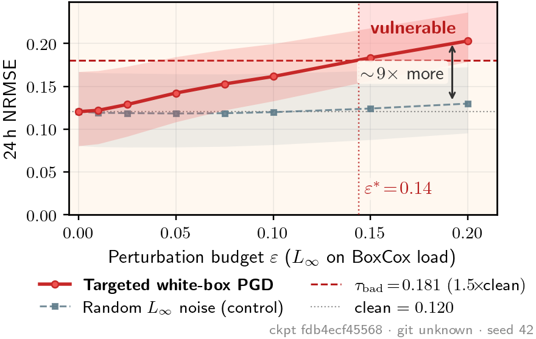

# Genesis 20.A — preliminary BuildingsBench vulnerability baseline

<p align="center">
  
</p>

**What this shows.** Under the same $L_\infty$ budget on the context-load channel, a **targeted white-box PGD** attack drives 24-hour aggregate NRMSE past an operator threshold $\tau_{\mathrm{bad}} = 1.5 \times \mathrm{clean}$ at $\varepsilon^\ast \approx 0.14$, while **matched-budget uniform noise** leaves NRMSE below $\tau_{\mathrm{bad}}$ for every $\varepsilon$ tested on this window sample. At $\varepsilon = 0.2$, excess degradation under PGD is $\sim 9\times$ that under noise (point estimate on $N=1020$ windows; bands are 95% bootstrap CIs over windows).

This repository holds **scripts, frozen result JSON, and the publication figure** for the DOE Genesis **Focus Area 20.A** (AI for adversarial robustness and resilience) preliminary result on NREL [BuildingsBench](https://github.com/NREL/buildingsbench) Transformer-L (Gaussian), zero-shot on the BDG-2 commercial slice (panther, bear, fox, rat).

---

## Contents

| Path | Description |
|------|-------------|
| `docs/figures/` | `preliminary_bar.png` / `.pdf` — figure rendered for the proposal (torch-free). |
| `results/experiment_final.json` | PGD sweep (aggregate NRMSE + bootstrap CIs per $\varepsilon$). |
| `results/experiment_random.json` | Uniform $L_\infty$ noise control, same protocol. |
| `scripts/plot_from_json.py` | Regenerate the figure from the JSON files (no GPU, no `buildings_bench`). |
| `scripts/run_experiment.py` | Full pipeline: load public checkpoint + data, PGD/noise, JSON + figure (GPU, see below). |

## Quick start — reproduce the figure from JSON

Requires Python 3.10+ with NumPy and Matplotlib. LaTeX must be available on `PATH` (Matplotlib `usetex`).

```bash
python3 -m venv .venv && source .venv/bin/activate
pip install -r requirements-plot.txt

python scripts/plot_from_json.py \
  --json results/experiment_final.json \
  --random-json results/experiment_random.json \
  --out docs/figures/preliminary_bar.pdf
```

This overwrites `docs/figures/preliminary_bar.pdf` and `.png`.

## Full experiment — re-run measurements (advanced)

End-to-end replication needs:

- Public checkpoint **Transformer_Gaussian_L.pt** (NREL / OEDI; $\approx$1.8 GB) — see [BuildingsBench checkpoints](https://github.com/NREL/buildingsbench#checkpoints).
- **BuildingsBench v2** dataset root with BDG-2 subsets and metadata (e.g. Box-Cox scaler paths).
- CUDA-capable PyTorch matching your GPU; Python environment with `buildings_bench` and dependencies (see upstream repo).

Example invocation (paths are examples — set yours accordingly):

```bash
export BUILDINGS_BENCH=/path/to/BuildingsBench
python scripts/run_experiment.py \
  --bb-root "$BUILDINGS_BENCH" \
  --ckpt /path/to/Transformer_Gaussian_L.pt \
  --datasets bdg-2:panther bdg-2:bear bdg-2:fox bdg-2:rat \
  --n-windows 1024 \
  --seeds 42 \
  --epsilons 0.0 0.01 0.025 0.05 0.075 0.1 0.15 0.2 \
  --attack pgd \
  --out results/experiment_final.json \
  --fig docs/figures/preliminary_bar.pdf
```

Repeat with `--attack random` to regenerate `experiment_random.json`. Pin the checkpoint SHA-256 in your notes; the JSON stores an 8-character prefix for traceability.

## Provenance (frozen JSON in `results/`)

| Field | Value (this bench snapshot) |
|-------|-------------------------------|
| Checkpoint SHA-256 (prefix) | `fdb4ecf45568` |
| Sampling seed | `42` |
| Windows (after filtering) | `1020` |
| Bootstrap resamples | `4000` (CI construction; see script) |

## Citation

If you use these artifacts, cite the BuildingsBench paper and this repository:

```bibtex
@misc{genesis20a_bench_2026,
  title        = {Genesis 20.A preliminary BuildingsBench vulnerability baseline},
  howpublished = {\url{https://github.com/UA-AI-Robustness/genesis-20a-bench}},
  year         = {2026},
  note         = {University of Alabama}
}
```

Primary dataset / model reference: Emami et al., BuildingsBench (NeurIPS 2023 Datasets \& Benchmarks track).

## License

Code and documentation are released under **Apache-2.0**. The BuildingsBench model weights and datasets remain under their respective upstream licenses (NREL / DOE distribution terms).

## Disclaimer

This is a **Phase-I preliminary measurement** for proposal and research planning; it is not a complete security evaluation of BuildingsBench or deployed grid workflows.
